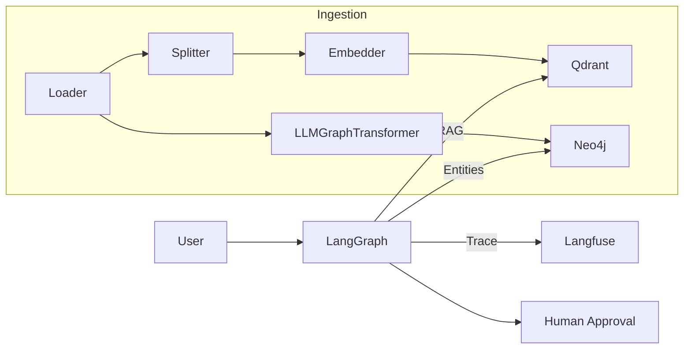

# 🧩 Personal Agentic Operating System
<p align="center">
  
</p>

> **Local-first LLM agents, orchestrated with LangGraph, powered by Qdrant & Neo4j, observable via Langfuse.**

[](./actions/workflows/ci.yml)
[](https://github.com/users/adrianwedd/packages)
[](https://adrianwedd.github.io/personal-agentic-operating-system/)

---

## 🚀 Features

| Capability | Detail |
|------------|--------|
| **On-prem, private** | All services run in Docker on your machine. No external API calls required. |
| **Pluggable LLM backends** | Switch between Ollama, OpenAI, Gemini or DeepSeek via `LLM_BACKEND` env var. |
| **Task-centric LangGraph** | Planner → Prioritise → PKG + Vector RAG → Tool execution → HITL checkpoint. |
| **Hybrid Retrieval** | Step-1 Neo4j entity lookup, Step-2 Qdrant metadata-filtered vector search. |
| **Self-improvement loop** | Reflection docs → meta-agent → updated guidelines injected at runtime. |
| **Observability** | Langfuse traces every node/tool; Mermaid graph rendered on each build. |

---

## 🏃‍♂️ Quick-start

```bash
git clone https://github.com/adrianwedd/personal-agentic-operating-system.git
cd personal-agentic-operating-system
./bootstrap.sh                  # 🚀 zero-click setup wizard
make ingest                    # populate Qdrant & PKG
python src/minimal_agent.py "Summarise my inbox"
make task-api                   # optional REST interface
uvicorn trace_agent.main:app --reload &  # start SSE backend
cd apps/graph-inspector && yarn dev  # live LangGraph viewer
bash scripts/check_db_connections.sh  # verify database access
```

> **Tip:** first launch downloads base Ollama model (~3 GB). Subsequent runs are instant.

## 🔗 Quick Links

| Resource | How to access |
|----------|---------------|
| **Langfuse dashboard** | <http://localhost:3000> |
| **Docs site** | `make docserve` → <http://127.0.0.1:8000> |
| **Graph inspector** | `uvicorn trace_agent.main:app --reload` + `cd apps/graph-inspector && yarn dev` → <http://localhost:5173> |
| **Run the agent** | `python src/minimal_agent.py "Hello"` |
| **Health check** | `python scripts/healthcheck.py` |

---

## 🧪 ClickHouse Bootstrapping

ClickHouse requires a `langfuse` database. On first start the `clickhouse` service
loads `init-clickhouse.sql` to create it automatically. If you need to recreate
the volume from scratch:

```bash
docker volume rm personal-agentic-operating-system_clickhouse_data
docker compose up -d clickhouse
```

To connect manually:

```bash
docker exec -it clickhouse clickhouse-client
```

Inside the SQL prompt:

```
CREATE DATABASE IF NOT EXISTS langfuse;
```

If the container health check fails with IPv6 errors, edit
`docker/clickhouse/config.xml` and ensure it contains:

```xml
<listen_host>0.0.0.0</listen_host>
<enable_ipv6>false</enable_ipv6>
```
Then restart the `clickhouse` service.

---

## 🗺 System Architecture



Full interactive diagram lives at **docs/architecture/langgraph_flow.md**.

---

## 📑 Core Docs

| Doc | Purpose |
|-----|---------|
| `AGENTS.md` | Personas & responsibilities |
| `TASKS.md`  | Task schema & lifecycle |
| `DEV_ENV.md`| Setup expectations |

Site-rendered docs: <https://adrianwedd.github.io/personal-agentic-operating-system/>

---

## 🧑‍💻 Developer Workflow

| Command | Action |
|---------|--------|
| `make dev` | Start Docker stack + install Python libs |
| `make test`| Ruff lint + pytest + coverage gate (80 %) |
| `make graph`| Render Mermaid PNG of current LangGraph |
| `make docserve`| Hot-reload MkDocs at <http://127.0.0.1:8000> |
| `make task-api`| Launch FastAPI task API |
| `yarn dev` (apps/graph-inspector)| Live graph inspector UI (requires `uvicorn trace_agent.main:app`) |

## 🔄 Meta-agent Schedule

Run `scripts/run_meta_agent.py` daily so the system can refine
`guidelines.txt` from reflection logs. Add a cron entry:

```cron
0 3 * * * /usr/bin/python /path/to/scripts/run_meta_agent.py >> ~/meta.log 2>&1
```

Systemd users can create a timer that calls the same script once per day.

---

## 🏗 Contributing

1. Create feature branch `codex/my-feature`.  
2. Add or update tasks in `.codex/tasks.yml` (Codex agents monitor this).  
3. Ensure `make test` & `make docbuild` are green.  
4. Open PR; the CI bot will auto-label based on task IDs.  

Happy hacking! 🛠

