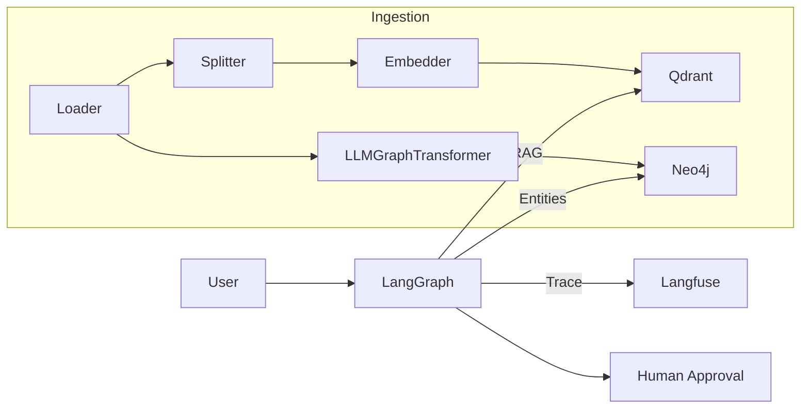

# 🧩 Personal Agentic Operating System
<p align="center">
  
</p>

> **Local-first LLM agents, orchestrated with LangGraph, powered by Qdrant & Neo4j, observable via Langfuse.**

[](./actions/workflows/ci.yml)
[](https://github.com/users/adrianwedd/packages)
[](https://adrianwedd.github.io/personal-agentic-operating-system/)

---

## 🚀 Features

| Capability | Detail |
|------------|--------|
| **On-prem, private** | All services run in Docker on your machine. No external API calls required. |
| **Task-centric LangGraph** | Planner → Prioritise → PKG + Vector RAG → Tool execution → HITL checkpoint. |
| **Hybrid Retrieval** | Step-1 Neo4j entity lookup, Step-2 Qdrant metadata-filtered vector search. |
| **Self-improvement loop** | Reflection docs → meta-agent → updated guidelines injected at runtime. |
| **Observability** | Langfuse traces every node/tool; Mermaid graph rendered on each build. |

---

## 🏃‍♂️ Quick-start

```bash
git clone https://github.com/adrianwedd/personal-agentic-operating-system.git
cd personal-agentic-operating-system
cp .env.example .env            # → edit secrets
make dev                        # pulls images, installs deps
python src/minimal_agent.py "Summarise my inbox"
```

> **Tip:** first launch downloads base Ollama model (~3 GB). Subsequent runs are instant.

---

## 🗺 System Architecture



Full interactive diagram lives at **docs/architecture/langgraph_flow.md**.

---

## 📑 Core Docs

| Doc | Purpose |
|-----|---------|
| `AGENTS.md` | Personas & responsibilities |
| `TASKS.md`  | Task schema & lifecycle |
| `DEV_ENV.md`| Setup expectations |

Site-rendered docs: <https://adrianwedd.github.io/personal-agentic-operating-system/>

---

## 🧑‍💻 Developer Workflow

| Command | Action |
|---------|--------|
| `make dev` | Start Docker stack + install Python libs |
| `make test`| Ruff lint + pytest + coverage gate (80 %) |
| `make graph`| Render Mermaid PNG of current LangGraph |
| `make docserve`| Hot-reload MkDocs at <http://127.0.0.1:8000> |

---

## 🏗 Contributing

1. Create feature branch `codex/my-feature`.  
2. Add or update tasks in `.codex/tasks.yml` (Codex agents monitor this).  
3. Ensure `make test` & `make docbuild` are green.  
4. Open PR; the CI bot will auto-label based on task IDs.  

Happy hacking! 🛠

