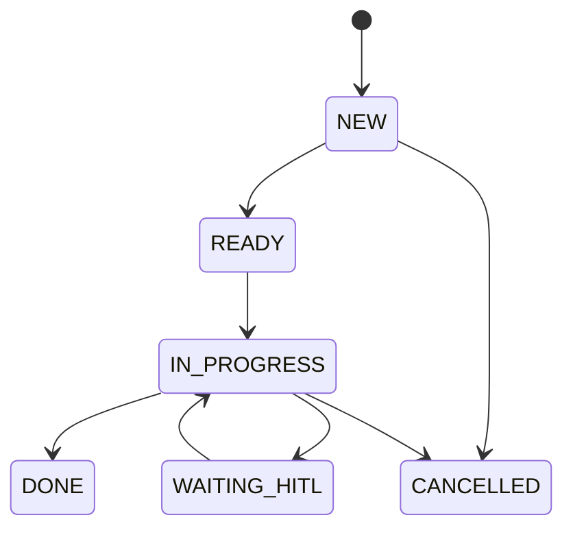

# TASKS Specification

This document defines the canonical task model and lifecycle used by all agents. It ensures consistent handling of work items across the graph.

## 1. Task Schema

Agents MUST create tasks that conform to this JSON structure. Optional fields may be omitted or set to `null`.

```jsonc
{
  "task_id": "<ulid>",
  "created_at": "2025-06-23T03:15:00Z",
  "source": "email:<gmail_msg_id>",
  "objective": "Schedule 30-min catch-up with Dr. Smith",
  "context": {
    "person": "Dr. Anna Smith",
    "threads": ["<msg1>", "<msg2>"],
    "meeting_duration": "30m"
  },
  "priority": "high",            // low | med | high | critical
  "status": "NEW",               // see lifecycle below
  "subtasks": [
    {"step": "propose_time_slots", "done": false},
    {"step": "send_calendar_invite", "done": false}
  ],
  "assigned_agent": "ToolingAgent",   // optional
  "last_updated": "2025-06-23T03:16:10Z",
  "tool_output": null,
  "result_summary": null
}
```

## 2. Lifecycle & Status Codes

Tasks move through a finite set of states. Allowed transitions are shown below.



| From → To | Who sets it | Trigger |
|-----------|-------------|---------|
| NEW → READY | prioritise node | deterministic rules pass |
| READY → IN_PROGRESS | execute_tool | tool call kicked off |
| IN_PROGRESS → WAITING_HITL | execute_tool | high-risk action requires confirmation |
| WAITING_HITL → IN_PROGRESS | Human | approval via CLI/Web UI |
| IN_PROGRESS → DONE | generate_response | all steps complete |
| * → CANCELLED | Human or Meta-Agent | duplication or abort |

## 3. Priority Rules

Deterministic rules come from `rules/priority.yml`. Example table:

| Rule | Sets priority → | Rationale |
|------|-----------------|-----------|
| sender_domain in bank_whitelist | high | finance alerts |
| objective matches `/invoice/i` | med | bookkeeping |
| LLM score ≥ 0.8 | high | fuzzy urgency |
| default | low | |

The `prioritise` node loads these rules and may combine them with an LLM-based urgency score.

## 4. Storage & Indexing

Tasks are stored in `sqlite:///data/tasks.db` with columns matching the JSON schema. A separate Qdrant collection `task_snippets` stores embeddings of the objective and context, keyed by `task_id`.

## 5. Graph Integration

| Node | Reads | Writes |
|------|-------|--------|
| plan_step | state.messages → creates new Task | state.tasks.append(new_task) |
| prioritise | task.priority | task.priority, task.status (READY) |
| retrieve_context | task.context | state.context_docs |
| execute_tool | task.subtasks | task.subtasks[x].done, task.status |
| generate_response | task.result_summary, state.tool_output | task.status (DONE) |

## 6. Human-in-the-Loop Checkpoints

When a node sets `task.status = WAITING_HITL`, the current state is serialized to `data/hitl_queue/`. A CLI command `make hitl` (or a minimal web UI) presents pending approvals and writes the result back, allowing the graph to resume.

## 7. Reflection Hooks

`generate_response` appends a summary blob to `data/reflections/DATE.jsonl`. The Meta-Agent processes these logs nightly, adjusts `rules/priority.yml`, and updates `guidelines.txt`. Future runs prepend the contents of `guidelines.txt` to the planner prompt.

